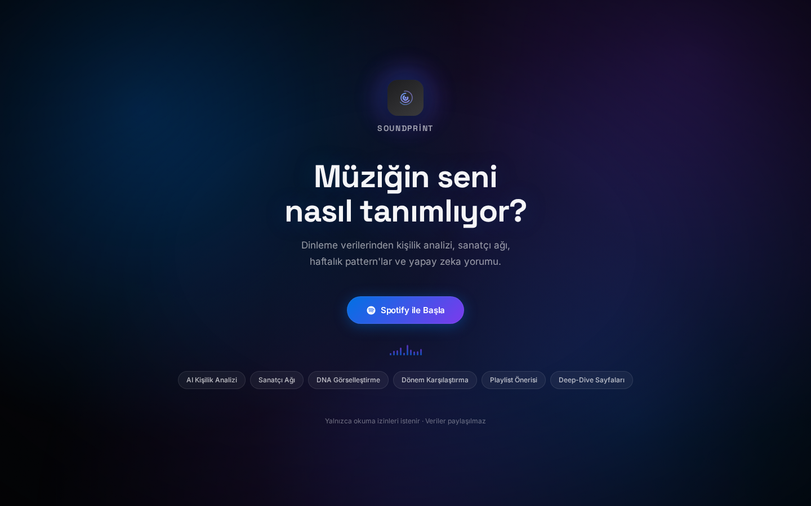
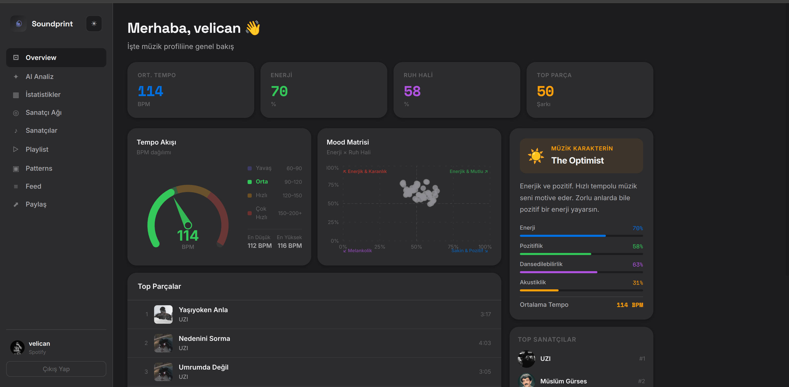
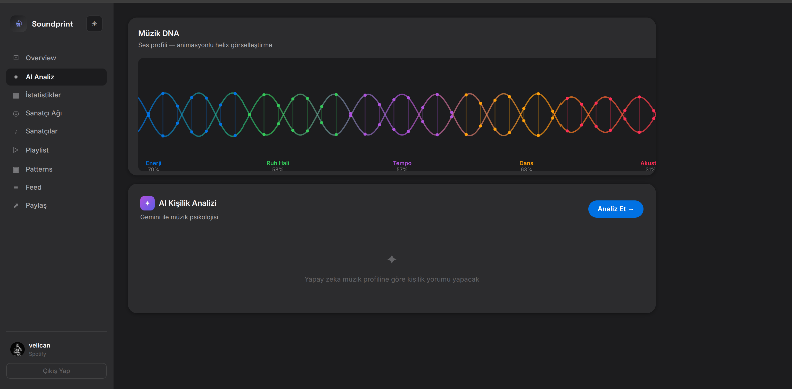
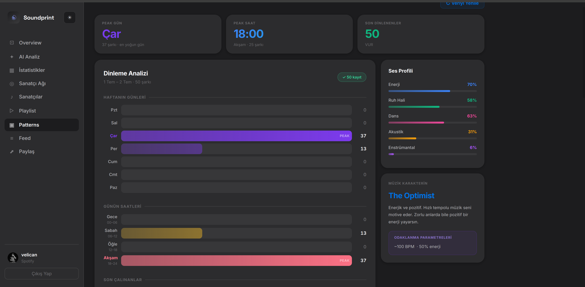
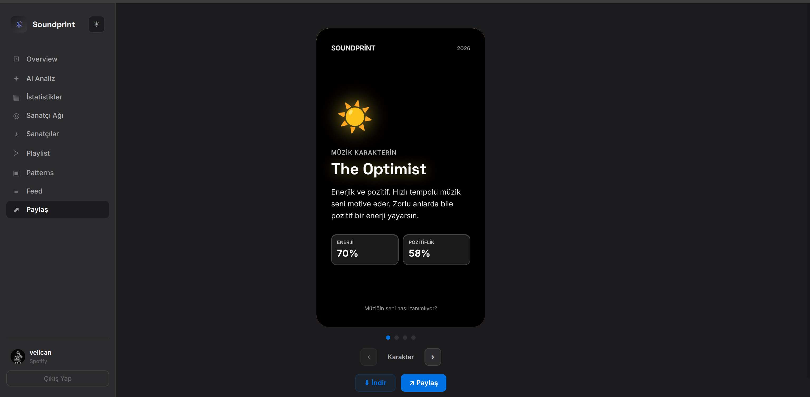
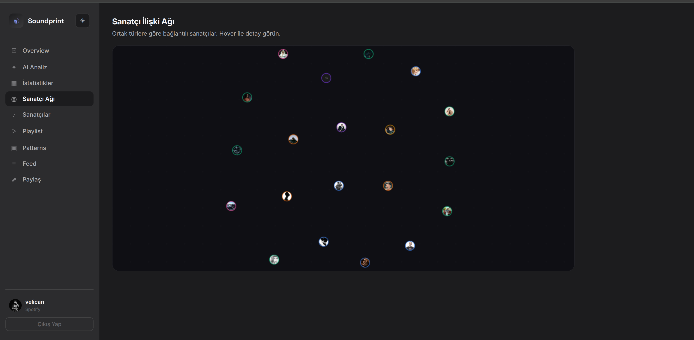

# Soundprint

[](https://github.com/chavooosss/soundprint/releases)
[](https://www.typescriptlang.org/)
[](https://react.dev/)
[](https://nodejs.org/)
[](LICENSE)
[](https://web.dev/progressive-web-apps/)

> **Spotify sana ne dinlediğini söyler. Soundprint sana kim olduğunu gösterir.**

Spotify dinleme verilerinden gerçek zamanlı kişilik analizi, müzik DNA görselleştirmesi, pattern haritası ve akıllı playlist motoru.

<p align="center">
  
  
</p>

---

## Neden Soundprint?

Spotify Wrapped yılda bir kez gelir ve "en çok dinlediğin 5 sanatçı" der. Bu yeterli değil.

İnsanlar müzikleriyle kendilerini anlamak istiyor: enerji profilim nedir, ne zaman daha çok dinliyorum, müziğim kişiliğim hakkında ne söylüyor, odaklanmak için hangi şarkıları seçmeliyim?

### Rakiplerden farkı

| | Soundprint | Spotify Wrapped | Last.fm | Stats for Spotify |
|---|---|---|---|---|
| Gerçek zamanlı | ✅ | ❌ Yılda bir | ✅ | ✅ |
| Kişilik arketipi | ✅ | ⚡ Sınırlı | ❌ | ❌ |
| Ses profili DNA | ✅ | ❌ | ❌ | ❌ |
| Dinleme pattern analizi | ✅ | ❌ | ❌ | ❌ |
| Akıllı playlist motoru | ✅ | ❌ | ❌ | ❌ |
| Haftalık karşılaştırma | ✅ | ❌ | ⚡ Sınırlı | ⚡ Sınırlı |
| Paylaşılabilir profil kartı | ✅ | ✅ | ❌ | ❌ |
| Türkçe müzik desteği | ✅ | ✅ | ⚡ Kısıtlı | ⚡ Kısıtlı |
| Kurulum gerektirmez | ✅ | ✅ | ❌ Ayrı kurulum | ✅ |
| Yüklenebilir (PWA) | ✅ | ❌ | ❌ | ❌ |

**Asıl fark:** Diğer uygulamalar liste gösterir. Soundprint seni *tanımlar*.

---

## Özellikler

### Overview
Müzik karakterini tek bakışta gör — enerji, ruh hali, tempo kartları, BPM eğrisi ve Mood matrisi.

### Karakter Arketipleri
Dinleme alışkanlıklarından çıkarılan kişilik profili:
- **The Optimist** — Enerjik, pozitif, motivasyon odaklı
- **The Night Owl** — Gece saatlerinde yoğun, melankolik tonlar
- **Deep Thinker** — Enstrümantal ağırlıklı, yüksek odak
- **The Flow State** — Sabit tempo, yüksek dans, süreklilik

### Müzik DNA
5 ses parametresi (enerji, ruh hali, dans, akustik, enstrümantal) animasyonlu helix görselleştirmesi.

<p align="center"></p>

### Dinleme Analizi (Patterns)
- Haftanın günlerine göre yoğunluk barları
- Günün saatlerine göre dağılım (Gece / Sabah / Öğle / Akşam)
- 2 saatlik kayan pencere ile gerçek peak saat tespiti
- Son dinlenenler listesi
- **Haftalık Karşılaştırma** — son 7 gün vs önceki 7 gün: dinleme sayısı, farklı parça/sanatçı, dönemin zirvesi. Spotify'ın sakladığı son 50 çalma yetersizse şeffaf uyarı gösterir

<p align="center"></p>

### Paylaşılabilir Profil Kartı
"Paylaş" sekmesinde 4 slaytlık bir profil kartı: Karakter, Top Sanatçılar, Top Parçalar, Ses DNA. Kartın arkaplanı, müzik kişiliğine (archetype) göre renklenen ve imleçle etkileşen bir **WebGL fluid simulation** efektiyle canlanır. PNG olarak indirilebilir veya Web Share API ile doğrudan paylaşılabilir.

<p align="center"></p>

### Akıllı Playlist Motoru
Spotify'ın kısıtladığı Recommendations API'sine bağlı kalmadan çalışır. Kendi genre-tabanlı tahmin algoritmasıyla:
- Mood hedefine göre şarkı skorlama
- Sanatçı çeşitliliği (aynı sanatçıdan max 2 parça)
- Şarkı ismi / Spotify URI kopyalama

### İstatistikler
3 dönem karşılaştırması (4 hafta / 6 ay / tüm zaman), Parça Popülaritesi ve Tür Dağılımı grafikleri.

### Sanatçı Ağı
Ortak türlere göre bağlantılı sanatçı grafiği — canvas fizik simülasyonu.

<p align="center"></p>

### AI Analiz *(Opsiyonel — Gemini API key gerekir)*
Müzik psikolojisi yorumu: Kişilik, Ruh Dünyası, Hayat Tarzı İpuçları.

### PWA — Yüklenebilir Uygulama
Soundprint, tarayıcıya veya telefon ana ekranına yüklenebilir bir Progressive Web App'tir. Service worker sayesinde:
- Uygulama kabuğu (shell) offline'da bile açılır, çevrimdışıyken net bir "Çevrimdışısın" ekranı gösterir (oturumdan çıkmış gibi görünmez)
- Spotify görselleri ve profil verisi akıllıca önbelleğe alınır (auth istekleri asla önbelleklenmez)

---

## Teknik Notlar

### Spotify API Kısıtlamaları (Kasım 2024 sonrası)
Spotify, yeni uygulamalar için **Audio Features** ve **Recommendations** endpoint'lerini kısıtladı. Soundprint bunu şöyle aşıyor:

- **Genre-tabanlı tahmin motoru** — 21 tür profili üzerinden enerji/valence/tempo tahmini
- **Frontend playlist engine** — Tüm öneri mantığı tarayıcıda çalışır, backend DNS hatalarına bağımlılık yok
- **Türkçe müzik desteği** — Türk sanatçıların Spotify'da tür verisi olmadığı durumlarda popülarite tabanlı gösterim

### Playlist Kaydetme
Spotify'ın Development Mode kısıtlamaları nedeniyle playlist yazma (403) şu an engelleniyor. Geçici çözüm: şarkı isimlerini ve URI'lerini kopyalama butonları.  
*Kalıcı çözüm: Spotify Extended Quota Mode başvurusu.*

---

## Mimari

```
soundprint/
├── backend/                    # Node.js + Express + TypeScript
│   └── src/
│       ├── config/             # Env var yönetimi
│       ├── middleware/         # Auth + otomatik token yenileme
│       ├── routes/             # /auth + /api/analysis
│       └── services/           # Spotify API client, analiz + genre tahmini
│
└── frontend/                   # React 18 + TypeScript + Vite
    └── src/
        ├── components/         # PatternHeatmap, PlaylistEngine, StatsCharts...
        ├── pages/              # Login, Dashboard
        ├── services/           # API client
        └── types/              # CharacterProfile, AudioStats
```

Vite proxy ile frontend `/auth` ve `/api` isteklerini backend'e yönlendirir.

---

## Kurulum

### 1. Spotify App oluştur

[developer.spotify.com/dashboard](https://developer.spotify.com/dashboard) → **Create App**

- Redirect URI: `http://127.0.0.1:3001/auth/callback`
- İzinler: `user-top-read`, `user-read-recently-played`, `user-read-email`, `user-read-private`

### 2. Backend

```bash
cd backend
cp .env.example .env   # aşağıdaki değerleri doldur
npm install
npm run dev            # → http://127.0.0.1:3001
```

### 3. Frontend

```bash
cd frontend
npm install
npm run dev            # → http://localhost:3000
```

### 4. Aç

`http://localhost:3000` → **Spotify ile Başla**

---

## `.env` Referansı

```env
SPOTIFY_CLIENT_ID=...
SPOTIFY_CLIENT_SECRET=...
SPOTIFY_REDIRECT_URI=http://127.0.0.1:3001/auth/callback
SESSION_SECRET=<en az 32 karakter rastgele string>
GEMINI_API_KEY=...      # Opsiyonel — AI Analiz sekmesi için
CLIENT_URL=http://localhost:3000
```

---

## Güvenlik

- **OAuth CSRF koruması** — State parametresi server-side doğrulanır, süresi 10 dakika
- **Otomatik token yenileme** — Dolmadan 60 saniye önce middleware refresh yapar
- **API key izolasyonu** — Gemini key yalnızca backend'de, tarayıcıya ulaşmaz
- **Yalnızca okuma scope'ları** — Playlist yazma dışında hiçbir yazma izni talep edilmez
- **Veri paylaşımı yok** — Tüm veriler kullanıcının kendi session'ında tutulur

---

## Roadmap

- [x] Spotify Audio Features API bağımlılığı → genre-tabanlı tahmin motoru
- [x] Playlist öneri motoru (frontend, API bağımsız)
- [x] Dark mode
- [x] Mobil responsive
- [x] Dinleme pattern analizi (gün + saat dağılımı)
- [x] Çoklu dönem karşılaştırma (bu hafta vs geçen hafta)
- [x] Paylaşılabilir profil kartı (Wrapped benzeri, WebGL fluid efekt)
- [x] PWA desteği
- [ ] Spotify Extended Quota Mode → playlist kaydetme
- [ ] Login sayfası — sosyal kanıt / ekran görüntüsü galerisi

---

## Lisans

MIT — [LICENSE](LICENSE)
